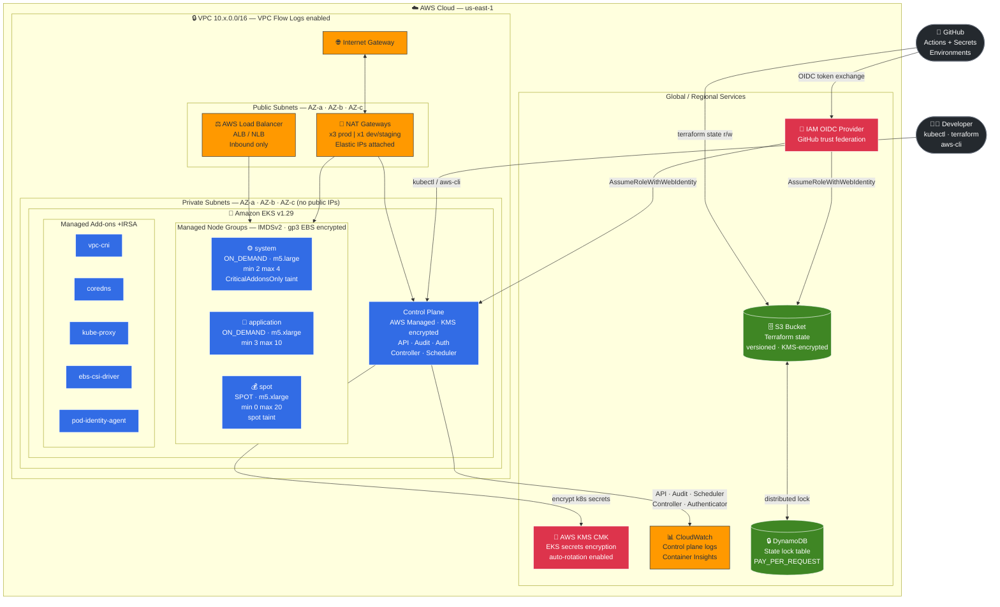
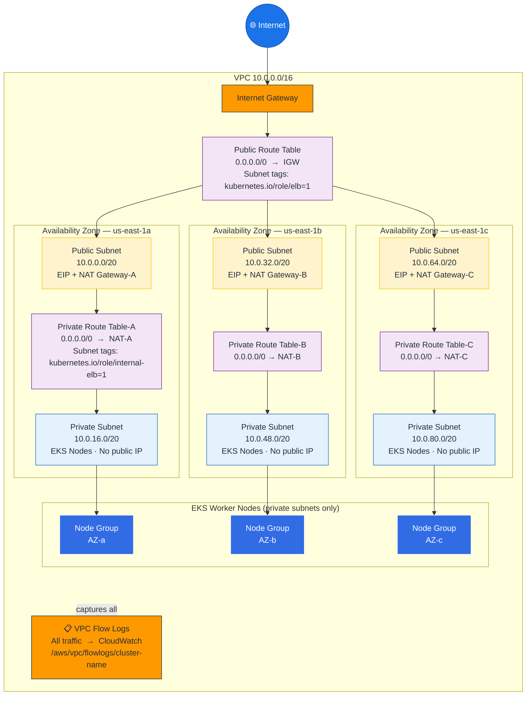
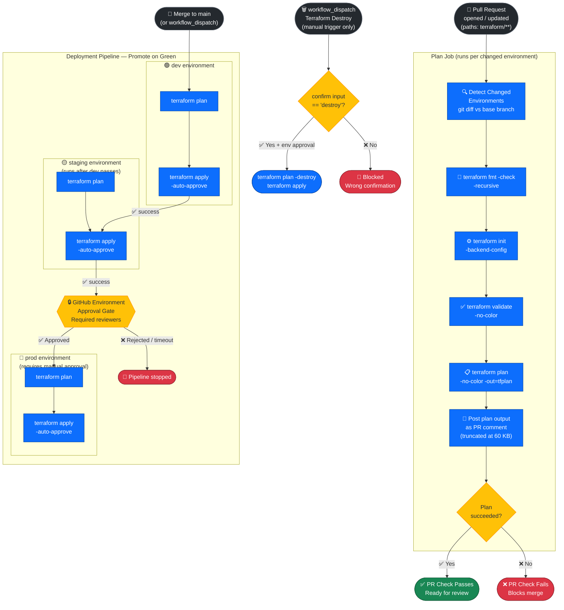
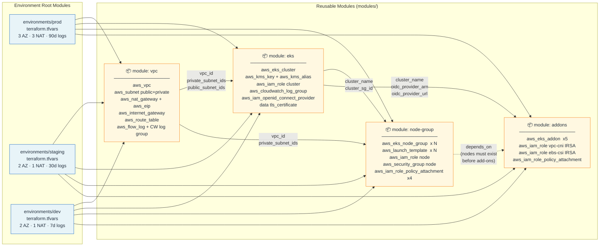
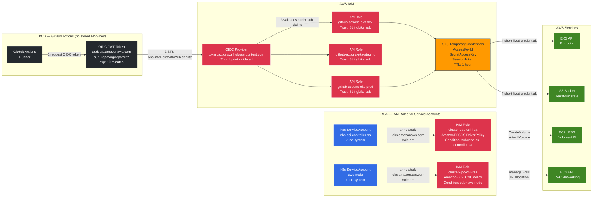

# DaaS EKS Infrastructure

> Production-grade Amazon EKS cluster on AWS — provisioned with Terraform, delivered by GitHub Actions

[](https://developer.hashicorp.com/terraform)
[](https://aws.amazon.com/eks/)
[](https://kubernetes.io)
[](https://github.com/features/actions)
[](LICENSE)

---

## Table of Contents

- [Overview](#overview)
- [Architecture Diagrams](#architecture-diagrams)
  - [1. Infrastructure Architecture](#1-infrastructure-architecture)
  - [2. VPC Network Topology](#2-vpc-network-topology)
  - [3. CI/CD Pipeline Flow](#3-cicd-pipeline-flow)
  - [4. Terraform Module Dependencies](#4-terraform-module-dependencies)
  - [5. IAM and Security Model](#5-iam-and-security-model)
- [Repository Structure](#repository-structure)
- [Technology Stack](#technology-stack)
- [Environment Comparison](#environment-comparison)
- [Prerequisites](#prerequisites)
- [Quick Start](#quick-start)
- [Accessing the Cluster](#accessing-the-cluster)
- [Module Reference](#module-reference)
- [Security Highlights](#security-highlights)
- [Monitoring and Logs](#monitoring-and-logs)
- [Troubleshooting](#troubleshooting)
- [Common Operations](#common-operations)
- [Production Best Practices](#production-best-practices)
- [FAQ](#faq)
- [Contributing](#contributing)
- [Additional Resources](#additional-resources)

---

## Overview

This project provisions and manages a **complete, hardened EKS platform** — from networking foundations to cluster add-ons — following AWS Well-Architected Framework principles across three fully isolated environments.

| Design Principle | Implementation |
| ---------------- | -------------- |
| **Infrastructure as Code** | All resources defined in versioned, reusable Terraform modules |
| **Environment isolation** | Separate VPC, cluster, and IAM roles per environment |
| **Keyless CI/CD** | GitHub Actions authenticates via OIDC token exchange — zero long-lived keys |
| **Security by default** | KMS-encrypted secrets, IMDSv2 enforced, private node subnets, IRSA for every add-on |
| **Promote on green** | `main` push deploys dev → staging → prod; prod is gated by manual approval |
| **Cost awareness** | Spot instances for non-critical workloads; single NAT GW in lower environments |

---

## Architecture Diagrams

> All diagrams are rendered natively by GitHub's Mermaid integration.

---

### 1. Infrastructure Architecture

High-level view of all AWS resources and how GitHub Actions, developers, and the Terraform backend interact with the cluster.



---

### 2. VPC Network Topology

Detailed view of subnet CIDR allocation, routing, and traffic flow across all three availability zones.



> **prod** deploys a NAT Gateway per AZ (×3) for high availability. **dev** and **staging** use a single NAT Gateway to reduce cost.

---

### 3. CI/CD Pipeline Flow

End-to-end workflow from pull request to production, including the manual approval gate.



---

### 4. Terraform Module Dependencies

How environment root modules consume shared modules, and the data flow between them via outputs.



---

### 5. IAM and Security Model

How GitHub Actions authenticates to AWS without stored credentials, and how EKS pods access AWS services via IRSA.



---

## Repository Structure

```text
eks-infra-creation/
├── .github/
│   └── workflows/
│       ├── terraform-plan.yml      # PR: fmt + validate + plan + PR comment
│       ├── terraform-apply.yml     # Push to main: dev → staging → prod
│       └── terraform-destroy.yml  # Manual only — requires "destroy" confirmation
│
├── terraform/
│   ├── modules/
│   │   ├── vpc/                   # VPC, subnets, NAT GWs, flow logs
│   │   │   ├── main.tf
│   │   │   ├── variables.tf
│   │   │   └── outputs.tf
│   │   ├── eks/                   # EKS cluster, KMS, OIDC, CloudWatch
│   │   │   ├── main.tf
│   │   │   ├── variables.tf
│   │   │   └── outputs.tf
│   │   ├── node-group/            # Managed node groups, launch templates, IAM
│   │   │   ├── main.tf
│   │   │   ├── variables.tf
│   │   │   └── outputs.tf
│   │   └── addons/                # EKS managed add-ons + IRSA roles
│   │       ├── main.tf
│   │       ├── variables.tf
│   │       └── outputs.tf
│   │
│   └── environments/
│       ├── dev/                   # 2 AZ · 1 NAT GW · spot · 7-day logs
│       │   ├── main.tf            # Backend + provider + module wiring
│       │   ├── variables.tf
│       │   ├── outputs.tf
│       │   └── terraform.tfvars
│       ├── staging/               # 2 AZ · 1 NAT GW · mixed · 30-day logs
│       │   └── ...
│       └── prod/                  # 3 AZ · 3 NAT GWs · 3 node groups · 90-day logs
│           └── ...
│
├── scripts/
│   ├── bootstrap.sh               # Create S3 bucket + DynamoDB table for state
│   ├── setup-github-oidc.sh       # Create OIDC IAM roles (keyless GitHub auth)
│   └── update-kubeconfig.sh       # Update ~/.kube/config after apply
│
├── .gitignore
└── README.md
```

---

## Technology Stack

| Category | Technology | Version | Purpose |
| -------- | ---------- | ------- | ------- |
| **IaC** | Terraform | >= 1.5 | Infrastructure provisioning and lifecycle |
| **Cloud Platform** | AWS | — | Target cloud provider |
| **Kubernetes** | Amazon EKS | 1.29 | Managed Kubernetes control plane |
| **Networking** | AWS VPC | — | Isolated multi-AZ network fabric |
| **Compute** | EC2 Managed Node Groups | — | EKS worker node lifecycle management |
| **Storage** | Amazon EBS gp3 | — | Encrypted persistent volume backing |
| **Encryption** | AWS KMS (CMK) | — | EKS secrets encryption at rest |
| **Identity** | IRSA / EKS Pod Identity | — | Fine-grained IAM for pods |
| **CI/CD Auth** | GitHub OIDC | — | Keyless AWS authentication in workflows |
| **CI/CD Platform** | GitHub Actions | — | Automated plan, apply, and destroy |
| **State Backend** | S3 + DynamoDB | — | Remote state storage with distributed locking |
| **Observability** | Amazon CloudWatch | — | Control plane logs and Container Insights |
| **Add-on Delivery** | EKS Managed Add-ons | — | vpc-cni, coredns, ebs-csi, kube-proxy |

---

## Environment Comparison

| Feature | dev | staging | prod |
| ------- | --- | ------- | ---- |
| VPC CIDR | 10.2.0.0/16 | 10.1.0.0/16 | 10.0.0.0/16 |
| Availability Zones | 2 | 2 | 3 |
| NAT Gateways | 1 (cost saving) | 1 (cost saving) | 3 (HA) |
| Node groups | 1 (spot only) | 2 (system + app) | 3 (system + app + spot) |
| Primary instance | t3.medium SPOT | m5.large SPOT | m5.xlarge ON_DEMAND |
| Min nodes | 1 | 2 | 5 (2+3) |
| Max nodes | 4 | 6 | 34 (4+10+20) |
| VPC flow logs | No | Yes | Yes |
| CW log retention | 7 days | 30 days | 90 days |
| Deployment gate | Auto | Auto (after dev) | Manual approval |
| Estimated cost | Low | Medium | Production |

---

## Prerequisites

| Tool | Min Version | Install Link |
| ---- | ----------- | ------------ |
| Terraform | 1.5.0 | [developer.hashicorp.com/terraform](https://developer.hashicorp.com/terraform/downloads) |
| AWS CLI | 2.x | [docs.aws.amazon.com/cli](https://docs.aws.amazon.com/cli/latest/userguide/getting-started-install.html) |
| kubectl | 1.28 | [kubernetes.io/docs/tasks/tools](https://kubernetes.io/docs/tasks/tools/) |
| git | any | [git-scm.com](https://git-scm.com/) |

Verify your environment:

```bash
terraform version    # must be >= 1.5
aws --version        # must be >= 2.x
kubectl version --client
aws sts get-caller-identity   # confirm correct AWS identity
```

---

## Quick Start

### Step 1 — Bootstrap the Terraform backend

Run once per AWS account to create the S3 state bucket and DynamoDB lock table:

```bash
chmod +x scripts/*.sh
./scripts/bootstrap.sh us-east-1 daas
```

The script prints the bucket name. Replace the placeholder in every environment:

```bash
# Linux / macOS
sed -i "s/REPLACE_WITH_YOUR_STATE_BUCKET/<your-bucket-name>/g" \
  terraform/environments/*/main.tf

# Windows PowerShell
Get-ChildItem -Path terraform/environments -Recurse -Filter main.tf |
  ForEach-Object {
    (Get-Content $_.FullName) -replace 'REPLACE_WITH_YOUR_STATE_BUCKET','<your-bucket-name>' |
    Set-Content $_.FullName
  }
```

### Step 2 — Set up GitHub Actions OIDC (keyless AWS auth)

```bash
./scripts/setup-github-oidc.sh <github-org> <github-repo>
```

Add the printed IAM role ARNs as GitHub repository secrets (**Settings → Secrets and variables → Actions**):

| Secret name | Value |
| ----------- | ----- |
| `AWS_ROLE_ARN_DEV` | `arn:aws:iam::<account-id>:role/github-actions-eks-dev` |
| `AWS_ROLE_ARN_STAGING` | `arn:aws:iam::<account-id>:role/github-actions-eks-staging` |
| `AWS_ROLE_ARN_PROD` | `arn:aws:iam::<account-id>:role/github-actions-eks-prod` |

### Step 3 — Configure GitHub environment protection rules

Navigate to **Settings → Environments** in your repository:

| Environment | Protection rule |
| ----------- | --------------- |
| `dev` | None — auto-deploys on every push to `main` |
| `staging` | None — auto-deploys after `dev` passes |
| `prod` | **Required reviewers** — gates all production deploys |

### Step 4 — Deploy locally (optional validation)

```bash
cd terraform/environments/dev
terraform init
terraform plan -out=tfplan
terraform apply tfplan
```

Update your kubeconfig after the cluster is up:

```bash
./scripts/update-kubeconfig.sh dev
kubectl get nodes -o wide
```

---

## Accessing the Cluster

### Update kubeconfig

```bash
# Via the helper script (reads cluster name from Terraform output)
./scripts/update-kubeconfig.sh prod

# Or directly with the AWS CLI
aws eks update-kubeconfig \
  --region us-east-1 \
  --name daas-prod-eks \
  --alias eks-prod
```

### Verify cluster access

```bash
kubectl get nodes -o wide
kubectl get pods -A
kubectl cluster-info
kubectl top nodes
```

### Switch between environment contexts

```bash
kubectl config get-contexts
kubectl config use-context eks-prod
kubectl config use-context eks-dev
```

---

## Module Reference

### `modules/vpc`

Multi-AZ VPC with public and private subnets, NAT gateways, and optional VPC flow logs. Subnets are tagged for EKS load balancer controller discovery (`kubernetes.io/role/elb` and `kubernetes.io/role/internal-elb`).

| Variable | Default | Description |
| -------- | ------- | ----------- |
| `cluster_name` | required | Used for naming and EKS subnet discovery tags |
| `vpc_cidr` | `10.0.0.0/16` | VPC CIDR block |
| `az_count` | `3` | Number of availability zones (2 or 3) |
| `single_nat_gateway` | `false` | Single NAT GW to save cost — non-prod only |
| `enable_flow_logs` | `true` | Ship all VPC traffic to CloudWatch |

**Key outputs:** `vpc_id`, `private_subnet_ids`, `public_subnet_ids`, `vpc_cidr_block`

---

### `modules/eks`

EKS control plane with KMS-encrypted secrets, OIDC provider for IRSA, and all five control plane log streams shipped to CloudWatch.

| Variable | Default | Description |
| -------- | ------- | ----------- |
| `cluster_version` | `1.29` | Kubernetes version |
| `endpoint_public_access` | `true` | Enable public API server endpoint |
| `public_access_cidrs` | `["0.0.0.0/0"]` | Restrict to VPN/office CIDRs in prod |
| `log_retention_days` | `30` | CloudWatch log group retention |

**Key outputs:** `cluster_name`, `cluster_endpoint`, `oidc_provider_arn`, `kms_key_arn`

---

### `modules/node-group`

Managed node groups using hardened launch templates — IMDSv2 required, gp3 EBS encrypted, and detailed EC2 monitoring enabled on every node.

Node group schema (used in `terraform.tfvars`):

```hcl
node_groups = {
  <name> = {
    instance_types = list(string)   # Multiple types for Spot capacity diversity
    capacity_type  = string         # "ON_DEMAND" or "SPOT"
    desired_size   = number         # Ignored after first apply (Cluster Autoscaler owns it)
    min_size       = number
    max_size       = number
    disk_size      = number         # GiB — gp3, encrypted
    labels         = map(string)    # Optional Kubernetes node labels
    taints = list(object({          # Optional Kubernetes taints
      key    = string
      value  = optional(string)
      effect = string               # NO_SCHEDULE | NO_EXECUTE | PREFER_NO_SCHEDULE
    }))
  }
}
```

**Key outputs:** `node_role_arn`, `node_security_group_id`, `node_groups`

---

### `modules/addons`

EKS managed add-ons with dedicated IRSA roles per add-on:

| Add-on | IRSA Policy | Purpose |
| ------ | ----------- | ------- |
| `vpc-cni` | `AmazonEKS_CNI_Policy` | Pod IP allocation via ENIs |
| `coredns` | — | Cluster-internal DNS |
| `kube-proxy` | — | iptables / ipvs rule management |
| `aws-ebs-csi-driver` | `AmazonEBSCSIDriverPolicy` | EBS PersistentVolume provisioning |
| `eks-pod-identity-agent` | — | Agent for EKS Pod Identity (next-gen IRSA) |

---

## Security Highlights

### Current Implementation

| Control | Detail |
| ------- | ------ |
| ✅ No long-lived AWS credentials | GitHub Actions uses OIDC JWT with 10-minute expiry; STS tokens are 1 hour |
| ✅ KMS customer-managed key | All Kubernetes secrets encrypted; key material auto-rotates annually |
| ✅ IMDSv2 enforced | `http_tokens = required` on every launch template — blocks SSRF credential theft |
| ✅ Private worker nodes | No public IPs on any EC2 node; egress only via NAT gateway |
| ✅ VPC flow logs | All VPC traffic captured to CloudWatch in staging and prod |
| ✅ Full control plane logging | All five log streams: API, Audit, Authenticator, Controller Manager, Scheduler |
| ✅ IRSA per add-on | Each add-on has a scoped IAM role bound to its service account via OIDC condition |
| ✅ EBS encryption | All node volumes encrypted at rest with AWS-managed key |
| ✅ SSM access | `AmazonSSMManagedInstanceCore` attached — shell access without SSH or open ports |

### Recommended Production Enhancements

| Enhancement | Why |
| ----------- | --- |
| ⚠️ Restrict `public_access_cidrs` | Lock the public API endpoint to your VPN/office IP range only |
| ⚠️ Kubernetes Network Policies | Restrict pod-to-pod traffic between namespaces |
| ⚠️ Pod Security Admission | Enforce `restricted` PSS profile in production namespaces |
| ⚠️ GuardDuty EKS Runtime Monitoring | Real-time threat detection on node and pod behaviour |
| ⚠️ Amazon Inspector for ECR | Continuous vulnerability scanning on container images |
| ⚠️ External Secrets Operator + AWS Secrets Manager | Avoid storing secrets as plain Kubernetes Secrets |
| ⚠️ AWS Config EKS rules | Continuous drift detection for CIS EKS Benchmark compliance |
| ⚠️ Falco | Host and container syscall-level anomaly detection |

---

## Monitoring and Logs

### Enable CloudWatch Container Insights

```bash
aws eks create-addon \
  --cluster-name daas-prod-eks \
  --addon-name amazon-cloudwatch-observability \
  --region us-east-1
```

### Query control plane logs

```bash
# List all EKS CloudWatch log groups
aws logs describe-log-groups \
  --log-group-name-prefix "/aws/eks/daas-prod-eks" \
  --query 'logGroups[].logGroupName' \
  --output table

# Tail audit logs in real time
aws logs tail /aws/eks/daas-prod-eks/cluster \
  --follow \
  --filter-pattern '{ $.verb = "create" || $.verb = "delete" }'

# Search for failed API calls
aws logs filter-log-events \
  --log-group-name /aws/eks/daas-prod-eks/cluster \
  --filter-pattern '{ $.responseStatus.code = 403 }' \
  --start-time $(date -d '1 hour ago' +%s000)
```

### kubectl observability

```bash
# Node resource pressure
kubectl top nodes
kubectl top pods -A --sort-by=memory

# Events sorted by time (useful after incidents)
kubectl get events -A --sort-by='.lastTimestamp' | tail -30

# Check pod logs with timestamps
kubectl logs -f deployment/<name> -n <namespace> --timestamps=true

# Describe a node for taints, conditions, and allocatable resources
kubectl describe node <node-name>

# Watch pod scheduling in real time
kubectl get pods -A -w
```

---

## Troubleshooting

### Nodes not joining the cluster

```bash
# Check node group status
aws eks describe-nodegroup \
  --cluster-name daas-prod-eks \
  --nodegroup-name daas-prod-eks-application \
  --region us-east-1 \
  --query 'nodegroup.{status:status,health:health}'

# Inspect EC2 user-data bootstrap logs
aws ec2 get-console-output --instance-id <id> --output text | tail -50

# Verify aws-auth ConfigMap (should be auto-populated for managed node groups)
kubectl describe configmap aws-auth -n kube-system
```

### Pod stuck in `Pending`

```bash
# Most common cause: resource pressure, unmatched node selectors, or taints
kubectl describe pod <pod-name> -n <namespace>

# Check node taints
kubectl get nodes -o json | jq '.items[].spec.taints // empty'

# Check available capacity
kubectl describe node <node-name> | grep -A 5 "Allocatable:"
```

### Pod stuck in `ImagePullBackOff`

```bash
# Check the exact error
kubectl describe pod <pod-name> -n <namespace> | grep -A 5 "Events:"

# If using a private ECR registry, verify the node role has ecr:GetAuthorizationToken
aws iam simulate-principal-policy \
  --policy-source-arn <node-role-arn> \
  --action-names ecr:GetAuthorizationToken
```

### `terraform init` fails with S3 403

The IAM role or user must have these permissions on the state bucket and lock table:

```text
s3:GetObject, s3:PutObject, s3:ListBucket, s3:DeleteObject
dynamodb:GetItem, dynamodb:PutItem, dynamodb:DeleteItem, dynamodb:DescribeTable
```

### GitHub Actions OIDC 403

1. Confirm `id-token: write` is in the workflow `permissions` block
2. Verify the trust policy uses `StringLike` (not `StringEquals`) for the `sub` claim
3. Confirm the `sub` pattern is `repo:<org>/<repo>:*` — wildcard must be `*`, not `ref:*`
4. Check the OIDC provider thumbprint is correct: `6938fd4d98bab03faadb97b34396831e3780aea1`

### EKS add-on stuck in `DEGRADED`

```bash
# Check add-on health
aws eks describe-addon \
  --cluster-name daas-prod-eks \
  --addon-name vpc-cni \
  --region us-east-1 \
  --query 'addon.{status:status,issues:health.issues}'

# Force reconcile
aws eks update-addon \
  --cluster-name daas-prod-eks \
  --addon-name vpc-cni \
  --resolve-conflicts OVERWRITE \
  --region us-east-1
```

---

## Common Operations

### Scale a node group

Edit `desired_size` / `min_size` / `max_size` in the environment's `terraform.tfvars`, open a PR, review the plan, and merge.

```bash
# Verify post-apply
kubectl get nodes -l role=application
aws eks describe-nodegroup \
  --cluster-name daas-prod-eks \
  --nodegroup-name daas-prod-eks-application \
  --query 'nodegroup.scalingConfig'
```

### Upgrade Kubernetes version

1. Check [AWS EKS Kubernetes release calendar](https://docs.aws.amazon.com/eks/latest/userguide/kubernetes-versions.html) for version support dates
2. Update `cluster_version` in the target environment's `terraform.tfvars`
3. Open a PR — review the plan output (only the cluster version changes)
4. Merge — EKS performs a rolling control plane upgrade; node groups follow

> Upgrade one minor version at a time: 1.28 → 1.29 → 1.30. Never skip versions.

### Update an add-on version

```bash
# Find the latest version for your cluster
aws eks describe-addon-versions \
  --kubernetes-version 1.29 \
  --addon-name aws-ebs-csi-driver \
  --query 'addons[0].addonVersions[0].addonVersion' \
  --output text
```

Update `addon_versions` in `terraform.tfvars`, open a PR, and merge.

### Drain a node for maintenance

```bash
kubectl cordon <node-name>
kubectl drain <node-name> --ignore-daemonsets --delete-emptydir-data --grace-period=60

# After maintenance window
kubectl uncordon <node-name>
```

### Add a new environment

1. Copy `terraform/environments/prod/` to `terraform/environments/<name>/`
2. Update the `backend` key, `environment` variable default, and `vpc_cidr`
3. Add the environment job to [terraform-apply.yml](.github/workflows/terraform-apply.yml)
4. Create the GitHub environment under **Settings → Environments**
5. Run `./scripts/setup-github-oidc.sh` and add `AWS_ROLE_ARN_<NAME>` as a secret

---

## Production Best Practices

### Cluster

```text
- 3 availability zones for control plane and node group HA (prod default)
- Dedicated system node group with CriticalAddonsOnly taint to isolate add-ons
- Deploy Cluster Autoscaler or Karpenter for automatic node provisioning
- Restrict public API endpoint CIDR to known VPN / office addresses
- Enable all five control plane log types (already configured)
```

### Compute

```text
- Use 3-4 instance types in Spot node groups for interruption resilience
- Keep system and database workloads on ON_DEMAND nodes
- Set CPU and memory requests+limits on all pods to enable bin-packing
- Use topology spread constraints to distribute pods across AZs
- Enable SSM agent for node access without SSH or bastion hosts (already configured)
```

### Storage

```text
- Use gp3 volumes (20% cheaper than gp2 with better baseline IOPS)
- Set PersistentVolumeClaim reclaim policy to Retain for stateful workloads
- Use Amazon EFS with aws-efs-csi-driver for ReadWriteMany access
- Enable automated EBS snapshot lifecycle policies for backup
```

### Networking

```text
- Nodes in private subnets with no public IPs (already configured)
- One NAT Gateway per AZ in prod to avoid single-AZ egress failure (already configured)
- Deploy AWS Load Balancer Controller for ALB/NLB Ingress management
- Use Kubernetes NetworkPolicies for east-west traffic isolation
- Tag subnets correctly for load balancer controller discovery (already configured)
```

### Security

```text
- Auto-rotate KMS key material (enable_key_rotation = true — already configured)
- Enable Amazon GuardDuty EKS Runtime Monitoring for runtime threat detection
- Use AWS Secrets Manager with External Secrets Operator for application secrets
- Apply Pod Security Admission with restricted profile in production namespaces
- Run Falco for syscall-level anomaly detection on nodes
```

### Cost Optimisation

```text
- Single NAT Gateway in dev/staging (already configured)
- Spot instances for stateless, interruption-tolerant workloads (already configured)
- Set Cluster Autoscaler min=0 on spot groups to scale to zero overnight in dev
- Use Compute Savings Plans for committed ON_DEMAND capacity in prod
- Enable AWS Cost Allocation Tags on all resources for per-environment attribution
```

---

## FAQ

**Q: How do I access a node without SSH?**
All nodes have `AmazonSSMManagedInstanceCore` attached. Use `aws ssm start-session --target <instance-id>` — no key pairs, no open ports, fully audited.

**Q: How do I create an IAM role for my application pods?**
Create an IAM role with an OIDC trust policy that references the cluster's OIDC issuer (use `module.eks.oidc_provider_arn` output). Annotate the pod's `ServiceAccount` with `eks.amazonaws.com/role-arn: <arn>`.

**Q: Can I run this across multiple AWS accounts (dev in account A, prod in account B)?**
Yes. Run `./scripts/bootstrap.sh` and `./scripts/setup-github-oidc.sh` once per account. Set the `AWS_ROLE_ARN_*` secrets to roles in the correct target accounts. The CI/CD workflows will authenticate to each account independently.

**Q: Why does Terraform not reset `desired_size` on every apply?**
`lifecycle { ignore_changes = [scaling_config[0].desired_size] }` is intentional — it allows Cluster Autoscaler to manage the running node count without Terraform reverting it on every apply. `min_size` and `max_size` are still enforced.

**Q: How do I promote a hotfix to prod without going through staging?**
Use `workflow_dispatch` on `terraform-apply.yml` and select `prod` as the target environment. You will still need to pass the GitHub environment approval gate.

**Q: Can I replace managed node groups with Karpenter?**
Yes. Remove the `node-group` module call from the environment `main.tf`, deploy Karpenter via Helm (add a new `karpenter` module or use a Helm release resource), and define `NodePool` and `EC2NodeClass` resources. The VPC and EKS modules remain unchanged.

**Q: How do I upgrade the AWS CLI version used in GitHub Actions?**
The `aws-actions/configure-aws-credentials@v4` action bundles its own AWS CLI. To pin a specific version, add `aws-actions/setup-aws-cli` before the configure step and pin the version there.

---

## Contributing

1. Fork the repository
2. Create a feature branch from `main`: `git checkout -b feature/your-feature`
3. Make changes to modules or environment configs
4. Open a PR — the plan workflow auto-runs and posts the diff as a comment
5. Address review feedback and ensure the plan output is clean
6. Merge — the pipeline promotes automatically through dev → staging; prod requires approval

---

## Additional Resources

| Resource | URL |
| -------- | --- |
| EKS Best Practices Guide | [aws.github.io/aws-eks-best-practices](https://aws.github.io/aws-eks-best-practices/) |
| Terraform AWS EKS Resource | [registry.terraform.io/providers/hashicorp/aws](https://registry.terraform.io/providers/hashicorp/aws/latest/docs/resources/eks_cluster) |
| GitHub OIDC with AWS | [docs.github.com — Configuring OIDC in Amazon Web Services](https://docs.github.com/en/actions/security-for-github-actions/security-hardening-your-deployments/configuring-openid-connect-in-amazon-web-services) |
| IAM Roles for Service Accounts | [docs.aws.amazon.com — IRSA](https://docs.aws.amazon.com/eks/latest/userguide/iam-roles-for-service-accounts.html) |
| EKS Managed Add-on Versions | [docs.aws.amazon.com — EKS Add-ons](https://docs.aws.amazon.com/eks/latest/userguide/eks-add-ons.html) |
| Cluster Autoscaler on EKS | [github.com/kubernetes/autoscaler](https://github.com/kubernetes/autoscaler/blob/master/cluster-autoscaler/cloudprovider/aws/README.md) |
| Karpenter | [karpenter.sh](https://karpenter.sh) |
| AWS Well-Architected Framework | [aws.amazon.com/architecture/well-architected](https://aws.amazon.com/architecture/well-architected/) |

---

**Last updated:** May 2026
**Maintainer:** Prashant Powar
**Version:** 1.0.0
